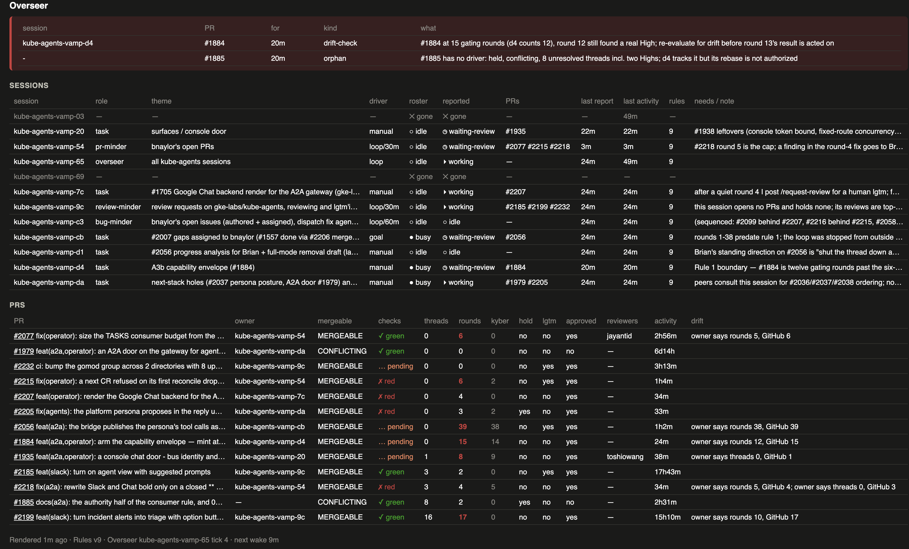

# ka-overseer

One Claude Code session that watches all your other Claude Code sessions: who is working on
what, which PRs they own, where each PR sits against the human gate, who is stalled waiting on
you, and a dashboard so you read one table instead of ten transcripts.

It came out of running eight to ten parallel sessions on one repo. The two pains it fixes:
sessions pausing on a question you do not notice for an hour, and the cognitive load of
tracking which session owns which PR in what state. `docs/brief-original.md` is the original
problem statement; `docs/design.md` is the design plus what the spike and the first live run
taught.

## How it works

- **Sessions report by message** in a six-line schema (`docs/protocol.md`). The skill in
  `skills/` teaches every session the schema, the message types, and the stall traps,
  including the one that matters most: *before you ask the human anything, send
  `status: waiting-human: <question>`*.
- **The Overseer session** runs `python3 overseer/ovsr.py tick`, sends the PING / STOP /
  ADVICE / INTRO messages the tick prints, and pipes every incoming report into
  `python3 overseer/ovsr.py report`. Its loop brief is `briefs/overseer-loop.txt`.
- **`overseer/watch.sh`** runs every 60 s from a spare terminal: reads the session roster
  (`claude agents --json`), re-renders the dashboard, and fires one macOS notification the
  first time a session shows as `waiting` (parked on a question or permission prompt).
- **GitHub** is read directly with `gh` for mergeability, checks, unresolved threads,
  gating-bot rounds, labels, and reviewers, and compared against each owner's last report.
  Disagreements show as *drift*, which in the first live run caught three bot rounds that had
  landed with new threads before their owners knew.
- **The dashboard** (`overseer/dashboard.html`) is a static page that reloads every minute.
  The red band on top is the only red on the page: it is the queue of things waiting on you.

What the Overseer may direct versus only advise, the thresholds, and the ladder (ping, ping,
notify) are in `docs/escalation.md`. The numbered rules it relays are in `docs/rules.md`; the
shipped set is the kube-agents team's, edit freely.

## Quick start

1. Put this directory somewhere stable, e.g. `~/ka-overseer`. The code finds its own files.
2. Edit `overseer/config.json`: your repo, the gating bot login, the advisory bot login (or
   `""`), the round cap, the regex matching your session names, any checkout path prefixes whose sessions count regardless of name (`cwd_prefixes`), and how the human is named.
3. `./install.sh` symlinks the skill into `~/.claude/skills/` so every session can see it, and
   runs the test suite.
4. In a spare terminal: `zsh overseer/watch.sh`.
5. Start a Claude Code session in this directory and give it `briefs/overseer-loop.txt` as a
   self-paced `/loop` prompt. It introduces itself to the sessions it finds, pulls GitHub,
   writes `overseer/state.json`, and opens the dashboard.
6. Add the sentence in `briefs/minder-report-in.txt` to the briefs of your other loops so new
   sessions report on start.

Requirements: macOS for `osascript` notifications (set `"notify"` to anything else to
disable), Python 3.11+ with no third-party packages, `gh` logged in, and a Claude Code with
cross-session messaging (`ListAgents`, `SendMessage`, `claude agents --json`).

## Layout

| Path | What |
| --- | --- |
| `overseer/ovsr.py` | the CLI: `tick`, `report`, `intro`, `sent`, `assign`, `retire`, `clear`, `rule`, `attention`, `rebuild` |
| `overseer/state.py` | the state model and every mutation; `state.json` is the single source of truth |
| `overseer/report.py` | the report parser |
| `overseer/signals.py` | the escalation engine, a pure function over state |
| `overseer/gh_snapshot.py` | the only place `gh` is called |
| `overseer/roster.py`, `overseer/watch.sh` | roster reader and the one-minute watcher |
| `overseer/render.py` | state to dashboard |
| `overseer/config.json` | deployment settings |
| `overseer/tests/` | `python3 -m pytest overseer/tests -q` |
| `docs/` | design, protocol, rules, escalation, original brief |
| `skills/working-with-the-overseer/` | the skill other sessions load |
| `briefs/` | the Overseer loop brief and the report-in sentence for other briefs |
| `tools/portify.py` | the transform that extracted this package from its origin repo, for the record |

Runtime files the Overseer writes into `overseer/`: `state.json`, `reports.log` (append-only,
rebuildable), `roster.json`, `dashboard.html`. They are git-ignored here; `reports.log` is
enough to rebuild the table.

## Things learned the hard way

- The session roster has four live states, not two: `busy`, `idle`, `shell`, and `waiting`.
  `waiting` means parked on a question or prompt. A message cannot unpark it; only the human
  can. Messages queue and arrive the moment the human answers.
- A session does not know its own name until it calls `ListAgents`; the first line says it.
- Skills hot-reload: a new symlink under `~/.claude/skills/` shows up in running sessions
  within a minute.
- Real reports contain semicolons inside parentheses, commentary after the status word,
  `none owned; ...#1234...`, and `no-hold ... hold lifted`. The parser handles all of these;
  `docs/protocol.md` lists the rules it applies.
- Short-lived sessions appear and vanish within minutes. There is a five-minute grace before
  an INTRO and a one-hour retirement for sessions that never reported.
- The merge-pool status context (`tide` on prow) is pending until merge; it is excluded from
  the checks roll-up via `ignored_check_contexts`.
- Six PRs were already past the round cap when the Overseer first looked. STOP therefore
  fires only when the count increases past the cap while tracked, never on first sight.
